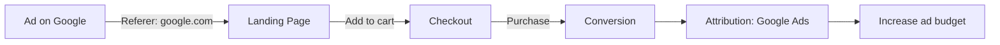

# Referer — Detailed Notes

> **Note:** The HTTP header is spelled **`Referer`** (one "r" in "referer"). This is a historical misspelling that was baked into the original HTTP/1.0 spec (RFC 1945) and has been kept for backward compatibility ever since. The correct English word is *referrer*.

---

## 1. What is the Referer?

The **Referer** is an HTTP request header that tells a web server **where the visitor came from** — i.e., the URL of the page that contained the link (or resource) the user clicked to arrive at the current page.

### Example

1. User is on `https://google.com/search?q=playwright`
2. User clicks a search result that points to `https://example.com/products`
3. The browser sends this request header to `example.com`:

```http
GET /products HTTP/1.1
Host: example.com
Referer: https://google.com/search?q=playwright
```

### Related headers / concepts

| Name | Purpose |
|---|---|
| `Referer` | Sent by the browser, tells the destination server the previous page URL |
| `Referrer-Policy` | A response header (set by the *destination* server) that controls **when** the `Referer` header is sent |
| `document.referrer` | JavaScript API that reads the referrer of the current page |
| `Referer` (Playwright) | Can be set manually via `page.setExtraHTTPHeaders()` or request context |

---

## 2. When is the Referer sent?

The `Referer` header is sent when navigating between pages or loading sub-resources (images, scripts, CSS, fonts, etc.). It is **not** sent (or is truncated) in these cases:

- **Direct navigation** — typing a URL directly, or using bookmarks (no previous page).
- **HTTPS → HTTP** — a secure page never sends a full referrer to an insecure (HTTP) page.
- **`Referrer-Policy`** — the destination server can restrict or disable it.
- **`rel="noreferrer"`** on a link — strips the referrer.
- **`rel="noopener"`** — often combined with `noreferrer` for security.
- **Sandboxed iframes** — may send `Referer` as `no-referrer` depending on sandbox flags.
- **`<meta name="referrer">`** — page-level control.

---

## 3. Role of Referer in Business Decisions

The Referer header is a core piece of **web analytics** and **marketing attribution**. It answers the question: *"Where did our traffic come from?"*

### 3.1 Traffic Source Attribution
- **Organic search** — `Referer: https://www.google.com/...` → the visitor came from a search engine.
- **Referral traffic** — `Referer: https://partner-site.com/...` → the visitor clicked a link on another site.
- **Direct traffic** — no referrer → the visitor typed the URL or used a bookmark.
- **Campaign tracking** — URLs with `utm_source`, `utm_medium`, `utm_campaign` query params are captured in the referrer, letting tools like Google Analytics attribute conversions to specific campaigns.

### 3.2 Marketing & Advertising Decisions
- **ROI / ROAS** — measure which channels (Google Ads, Facebook, affiliates) actually drive sales.
- **Budget allocation** — shift ad spend toward channels that produce high-quality referred traffic.
- **Affiliate programs** — affiliates are paid based on referred conversions; the referrer proves the traffic source.
- **Content strategy** — see which external sites drive the most engaged visitors.

### 3.3 Product & UX Decisions
- **Funnel analysis** — understand the path users take before converting.
- **Partner/ecosystem analytics** — measure the value of partnerships by referral volume.
- **A/B testing** — compare conversion rates of visitors from different sources.

### 3.4 Example business flow



---

## 4. Security Aspects of Referer

The Referer header is a **double-edged sword** — it is useful for analytics but can **leak sensitive information**.

### 4.1 Information Leakage (Referer Leakage)

The biggest risk: **URLs often contain sensitive data**, and the referrer sends that data to third parties.

| Scenario | What leaks |
|---|---|
| Password-reset link with token | `https://site.com/reset?token=abc123` → token leaks to any external resource on the page |
| Session IDs in URL | `https://site.com/dashboard?session=xyz` → session leaks |
| Search queries | `https://google.com/search?q=medical+condition` → private search terms leak |
| Internal paths | `https://intranet.corp/admin/users` → internal structure exposed |
| Cloud storage | `https://docs.google.com/...` → document IDs leak |

**How it happens:** if a page loads an external image/script/analytics pixel, that third party receives the full current-page URL in the `Referer` header.

### 4.2 CSRF (Cross-Site Request Forgery) — the "Referer check" defense

Some applications use the `Referer` header as a **CSRF defense-in-depth** check: they verify the request's `Referer` matches their own domain. If it doesn't, the request is rejected.

> ⚠️ **Caveat:** Referer-based CSRF checks are **not reliable** as a primary defense because:
> - The header can be **stripped** (HTTPS→HTTP, `Referrer-Policy`, `rel="noreferrer"`).
> - It can be **spoofed** by non-browser clients (curl, Postman, scripts).
> - Modern best practice is to use **CSRF tokens** (synchronizer tokens / double-submit cookies) instead.

### 4.3 Referrer-Policy — the mitigation

The destination server controls referrer behavior via the `Referrer-Policy` response header:

| Policy | Behavior |
|---|---|
| `no-referrer` | Never send the referrer (maximum privacy) |
| `no-referrer-when-downgrade` | **(browser default)** Send full referrer on same-origin & HTTPS→HTTPS; send nothing on HTTPS→HTTP |
| `origin` | Send only the origin (`https://site.com`), no path |
| `origin-when-cross-origin` | Full URL for same-origin, origin only for cross-origin |
| `same-origin` | Send referrer only for same-origin requests |
| `strict-origin` | Origin only, and nothing on downgrade |
| `strict-origin-when-cross-origin` | **(modern default)** Full URL same-origin, origin for cross-origin, nothing on downgrade |
| `unsafe-url` | Always send the full URL (most leaky — avoid) |

### 4.4 Security best practices

1. **Never put secrets in URLs** — use `POST` bodies or headers for tokens, session IDs, etc.
2. **Set a strict `Referrer-Policy`** — prefer `strict-origin-when-cross-origin` or `same-origin`.
3. **Use `rel="noreferrer"`** on external links (and `rel="noopener"` to prevent tabnabbing).
4. **Don't rely on Referer for auth/CSRF** — use tokens.
5. **Sanitize logs** — referrers with tokens can leak into server logs; redact them.

---

## 5. Referer in Playwright

Playwright lets you control the `Referer` header for testing:

```ts
// Set a referer for all requests from a page
await page.setExtraHTTPHeaders({ referer: 'https://example.com' });

// Or at the context level (applies to all pages in the context)
await context.setExtraHTTPHeaders({ referer: 'https://example.com' });
```

### Use cases in testing
- **Testing Referer-based analytics** — simulate traffic from a specific source and verify the analytics pixel fires.
- **Testing Referer-based CSRF checks** — verify the app rejects requests with a missing/wrong referrer.
- **Testing `Referrer-Policy`** — verify the correct policy is applied and no sensitive data leaks.

---

## 6. Quick Reference Summary

| Question | Answer |
|---|---|
| What is it? | HTTP header telling the server where the visitor came from |
| Why misspelled? | Historical typo in RFC 1945, kept for compatibility |
| Business role | Traffic attribution, marketing ROI, analytics, affiliate tracking |
| Security risk | Leaks sensitive URL data (tokens, queries, internal paths) to third parties |
| Main mitigation | `Referrer-Policy`, `rel="noreferrer"`, never put secrets in URLs |
| CSRF role | Sometimes used as a weak defense-in-depth check; not reliable alone |
| Playwright control | `page.setExtraHTTPHeaders({ referer: '...' })` |
